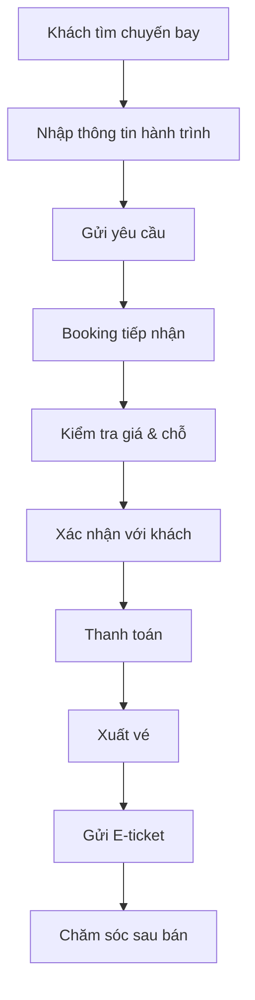

# 09 - Flight Booking Workflow

> Minh Việt Digital Platform Master Bible
> Version: 1.0.0

---

# Mục tiêu

Tài liệu này mô tả toàn bộ quy trình nghiệp vụ của Flight Platform từ lúc khách hàng bắt đầu tìm kiếm chuyến bay đến khi hoàn thành dịch vụ.

---

# Business Workflow

---

# Trạng thái Booking

| Status | Ý nghĩa |
|---------|---------|
| Draft | Khởi tạo |
| Waiting Confirmation | Chờ xác nhận |
| Waiting Payment | Chờ thanh toán |
| Paid | Đã thanh toán |
| Ticketed | Đã xuất vé |
| Completed | Hoàn thành |
| Cancelled | Hủy |
| Refunded | Hoàn tiền |

---

# Vai trò

## Customer

- Tìm kiếm
- Gửi yêu cầu
- Thanh toán
- Nhận vé

## Booking Staff

- Kiểm tra giá
- Giữ chỗ
- Xác nhận
- Xuất vé

## Accountant

- Đối soát
- Kiểm tra thanh toán
- Hóa đơn

## Admin

- Cấu hình
- Báo cáo
- Phân quyền

---

# Business Rules

## Rule 01

Không tự động xuất vé khi chưa xác nhận thanh toán.

## Rule 02

Cho phép Booking chỉnh sửa thông tin trước khi xuất vé.

## Rule 03

Lưu toàn bộ lịch sử thay đổi.

## Rule 04

Thông báo khách hàng ở mọi thay đổi trạng thái.

---

# Notification

Thông báo qua:

- Email
- SMS (tùy chọn)
- Zalo OA (tương lai)
- App Notification (tương lai)

---

# Exception Flow

- Hết chỗ
- Giá thay đổi
- Thanh toán thất bại
- Hãng hủy chuyến
- Khách yêu cầu đổi
- Khách yêu cầu hoàn

Mỗi tình huống phải có quy trình xử lý riêng.

---

# KPI

- Phản hồi yêu cầu < 10 phút
- Xác nhận Booking < 30 phút
- Tỷ lệ lỗi xuất vé = 0
- Lưu đầy đủ Audit Log

---

# Claude Code Guidance

Workflow phải được triển khai dưới dạng State Machine.

Không dùng chuỗi if/else dài để xử lý trạng thái.

Mỗi trạng thái phải định nghĩa:

- Allowed Actions
- Next Status
- Permission
- Notification

---

# Definition of Done

- Workflow hoàn chỉnh
- State rõ ràng
- Có Audit
- Có Notification
- Có khả năng mở rộng nhiều hãng và nhiều nhà cung cấp API

---

**End of 09-Flight-Booking-Workflow.md**
