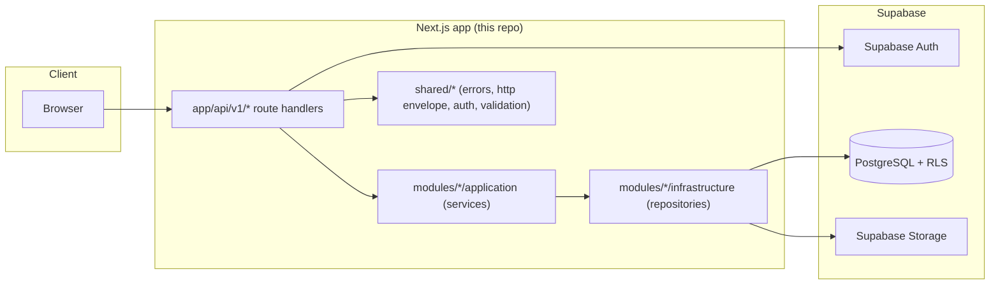

# System Overview — MV Travel OS

Modular monolith, one Next.js App Router codebase, per Volume 00 (`04-technical-stack.md`) and master-prompt §5/§15. No microservices, no separate backend service.

## Request lifecycle (master-prompt §14)

Route Handler → Zod validation → `resolveActor()` (Supabase Auth session → `ActorContext`) → Application Service (`requirePermission` calls) → Repository (Supabase queries, itself still gated by RLS) → Postgres. Every response is one of the two envelope shapes in `docs/api/api-conventions.md`, tagged with a `requestId` generated once per request (`shared/http/request-id.ts`).

Authorization is checked twice, deliberately: once in the service layer (`shared/auth/session.ts#requirePermission`) and once by RLS (`database/policies/`). Neither is trusted alone — the service check gives a clean `403 FORBIDDEN` with a specific message before a query is even attempted; RLS is the backstop if a service method is ever missing a check.

## Sprint 1A vs. Sprint 1B

Sprint 1A (this pass) is architecture-only: every file above compiles, but `shared/supabase/server-client.ts#getServerSupabaseClient()` and `shared/auth/session.ts#resolveActor()` both throw until a real Supabase project and Auth integration exist. See `docs/backend/sprint-1-implementation-plan.md` for the full phase breakdown and why.

## Scope decision this system embodies

Per `docs/backend/sprint-1-implementation-plan.md` §1: multi-site/multi-brand-capable schema, but only `minhviettravel.com` active (plus `vemaybay.minhviettravel.com` as a `PLANNED` record); Volume 00's 8-role list, not a larger custom one; CRM and Booking Request explicitly deferred to Sprint 2, not built here.
