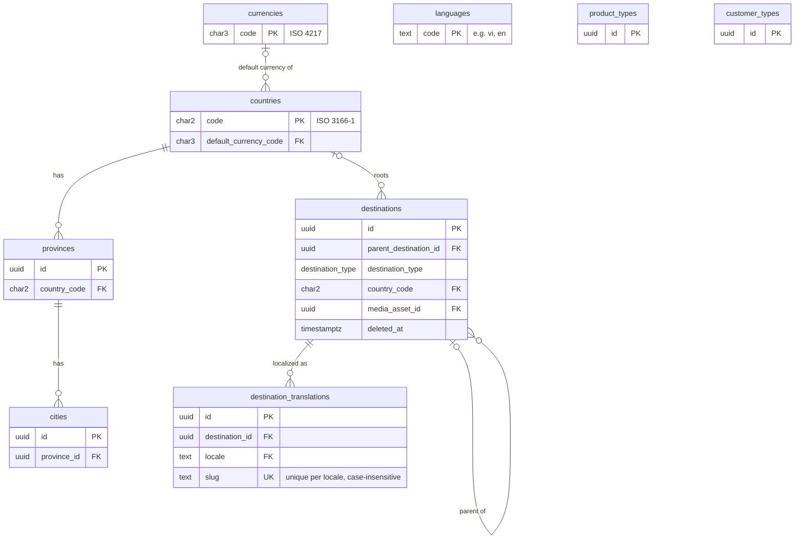
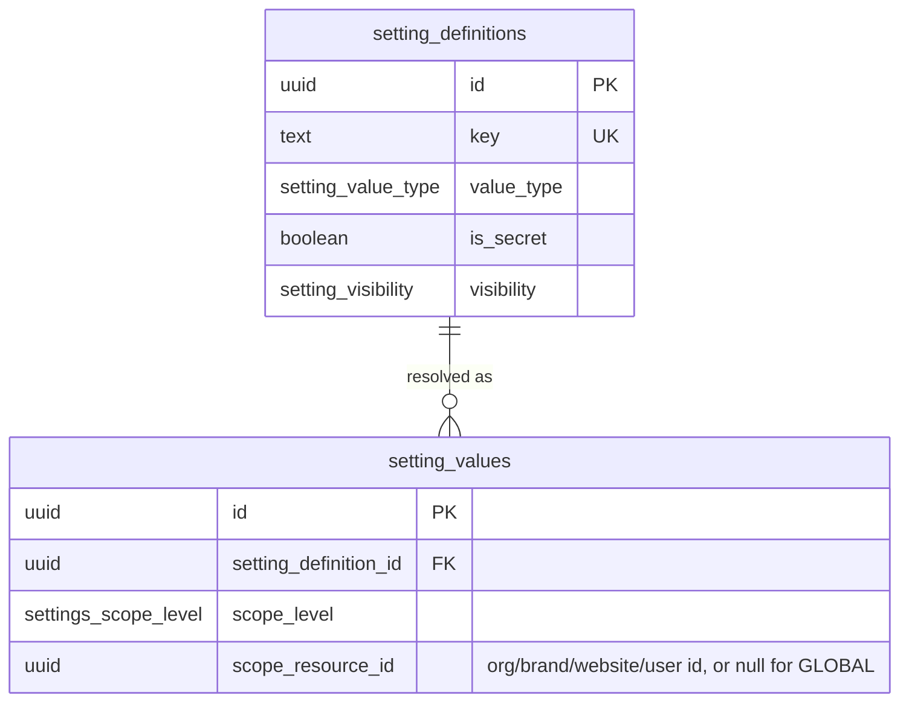

# Sprint 1 ERD — MV Travel OS (post Sprint 1A.2 reduction)

Generated directly from `database/migrations/0001`–`0013`. If this ever disagrees with the migrations, the migrations win — regenerate this file, don't hand-edit around a drift. Not yet applied to a live project (Sprint 1A/1A.2 is architecture-only).

**47 tables**, down from the original 77 (`docs/backend/sprint-1a2-reduction-report.md`). The Notifications and Integration Registry modules have no tables at all in this pass — they are documented as future extension points only (`docs/architecture/future-travel-domains.md`), not drawn here.

Attribute lists below show primary keys, foreign keys, and columns load-bearing for understanding the relationship — not every column (see `docs/database/data-dictionary.md` for the full column-by-column reference).

## Organization, identity, RBAC

```mermaid
erDiagram
  organizations ||--o{ brands : "has"
  organizations ||--o{ business_units : "has"
  organizations ||--o{ offices : "has"
  organizations ||--o{ departments : "has"
  organizations ||--o{ user_organization_memberships : "has members"
  brands ||--o{ websites : "publishes"
  business_units |o--o{ departments : "groups"
  offices |o--o{ departments : "hosts"
  departments |o--o{ departments : "parent of"
  departments ||--o{ positions : "defines"
  departments |o--o{ employee_profiles : "employs"
  positions |o--o{ employee_profiles : "held by"
  websites ||--o{ user_website_access : "grants access"

  user_profiles ||--o| employee_profiles : "extends to"
  user_profiles ||--o{ user_organization_memberships : "member of"
  user_profiles ||--o{ user_website_access : "has access to"
  user_profiles ||--o{ user_roles : "holds"
  employee_profiles |o--o{ employee_profiles : "manager of"

  roles ||--o{ role_permissions : "grants"
  permissions ||--o{ role_permissions : "granted via"
  roles ||--o{ user_roles : "assigned as"
  user_roles ||--o{ role_scopes : "scoped by"

  organizations {
    uuid id PK
    text legal_name
    text display_name
    char2 country_code FK
    char3 default_currency_code FK
    text default_language_code FK
    entity_status status
  }
  brands {
    uuid id PK
    uuid organization_id FK
    text slug UK "case-insensitive, global (single-org simplification)"
    uuid logo_media_id FK
    entity_status status
  }
  websites {
    uuid id PK
    uuid brand_id FK
    citext domain UK "case-insensitive, active rows only (websites_domain_active_unique)"
    website_type website_type
    text default_locale FK
    char3 default_currency_code FK
    website_status status
    timestamptz deleted_at
  }
  business_units {
    uuid id PK
    uuid organization_id FK
    text code UK
  }
  offices {
    uuid id PK
    uuid organization_id FK
    char2 country_code FK
    boolean is_headquarters
  }
  departments {
    uuid id PK
    uuid organization_id FK
    uuid business_unit_id FK
    uuid office_id FK
    uuid parent_department_id FK
    text code UK
  }
  positions {
    uuid id PK
    uuid department_id FK
    text title
    smallint level
  }
  user_profiles {
    uuid id PK "= auth.users.id"
    text display_name
    uuid avatar_media_id FK
    account_status account_status
    timestamptz deleted_at
  }
  employee_profiles {
    uuid id PK
    uuid user_profile_id FK UK
    uuid department_id FK
    uuid position_id FK
    uuid office_id FK
    uuid manager_id FK
  }
  user_organization_memberships {
    uuid id PK
    uuid user_profile_id FK
    uuid organization_id FK
  }
  user_website_access {
    uuid id PK
    uuid user_profile_id FK
    uuid website_id FK
  }
  roles {
    uuid id PK
    text key UK "8 fixed roles, see seed data"
    boolean is_system
  }
  permissions {
    uuid id PK
    text key UK "dotted convention: module.entity.action"
    text module
  }
  role_permissions {
    uuid id PK
    uuid role_id FK
    uuid permission_id FK
  }
  user_roles {
    uuid id PK
    uuid user_profile_id FK
    uuid role_id FK
  }
  role_scopes {
    uuid id PK
    uuid user_role_id FK
    permission_scope_level scope_level
    uuid scope_resource_id
  }
```

Removed from this cluster in Sprint 1A.2: `user_brand_memberships` (merged into the organization-membership + explicit website-access model — `docs/backend/sprint-1a2-reduction-report.md` §3).

## Master data



Removed from this cluster in Sprint 1A.2 (no Sprint 1B consumer — Flight/Cruise/Supplier/Pricing domains don't exist yet): `airports`, `harbors`, `transportation_types`, `supplier_types`, `units_of_measure`, `tax_categories`.

## Settings



Removed: `setting_value_history` (merged into `audit_logs` — a settings write is logged like any other mutation).

## Media

```mermaid
erDiagram
  media_folders |o--o{ media_folders : "parent of"
  media_folders |o--o{ media_assets : "contains"
  websites |o--o{ media_folders : "scopes"
  websites |o--o{ media_assets : "scopes"

  media_folders { uuid id PK, uuid parent_folder_id FK, uuid website_id FK }
  media_assets {
    uuid id PK
    uuid folder_id FK
    uuid website_id FK
    text storage_path UK
    media_visibility visibility
    timestamptz deleted_at
  }
```

Removed: `brand_id` column from both tables (redundant with `website_id` → `brands.id`); `media_asset_versions`, `media_tags`, `media_asset_tag_mappings`, `media_usages` (no image-processing pipeline or admin media-library UI exists yet).

## CMS and navigation

```mermaid
erDiagram
  websites ||--o{ cms_pages : "publishes"
  cms_pages ||--o{ cms_page_versions : "has versions"
  cms_page_versions ||--o{ cms_sections : "contains"
  cms_sections ||--o{ cms_blocks : "contains"
  cms_block_definitions ||--o{ cms_blocks : "typed as"
  websites ||--o{ announcements : "shows"
  websites ||--o{ faq_categories : "has"
  faq_categories ||--o{ faqs : "contains"
  websites ||--o{ faqs : "shows"
  websites ||--o{ navigation_menus : "defines"
  navigation_menus ||--o{ navigation_items : "contains"
  navigation_items |o--o{ navigation_items : "parent of"
  cms_pages |o--o{ navigation_items : "linked from"
  seo_metadata |o--o{ cms_page_versions : "describes"

  cms_pages {
    uuid id PK
    uuid website_id FK
    text locale FK
    cms_page_type page_type
    text slug "unique per website+locale, case-insensitive"
    timestamptz deleted_at
  }
  cms_page_versions {
    uuid id PK
    uuid page_id FK
    integer version_number
    cms_lifecycle_status status
    uuid seo_metadata_id FK
    boolean is_current
  }
  cms_sections { uuid id PK, uuid page_version_id FK, integer position }
  cms_blocks { uuid id PK, uuid section_id FK, uuid block_definition_id FK, jsonb config }
  cms_block_definitions { uuid id PK, text key UK }
  announcements { uuid id PK, uuid website_id FK }
  faq_categories { uuid id PK, uuid website_id FK, text slug "case-insensitive per website" }
  faqs { uuid id PK, uuid faq_category_id FK, uuid website_id FK, text locale FK }
  navigation_menus { uuid id PK, uuid website_id FK, navigation_menu_key key, text locale FK }
  navigation_items { uuid id PK, uuid menu_id FK, uuid parent_item_id FK, uuid cms_page_id FK }
```

Removed: `cms_templates`, `cms_page_template_mappings` (and `cms_page_versions.template_id`), `reusable_content_blocks` — a named-template-picker and a reusable-block library both assume many pages needing an admin-selectable layout; today's (and this repo's existing) page composition is hardcoded in React.

## Forms

```mermaid
erDiagram
  websites ||--o{ forms : "defines"
  forms ||--o{ form_submissions : "receives"
  websites ||--o{ form_submissions : "receives"
  organizations ||--o{ form_submissions : "receives (denormalized for reporting)"
  cms_pages |o--o{ form_submissions : "sourced from"

  forms { uuid id PK, uuid website_id FK, text key UK "per website, case-insensitive" }
  form_submissions {
    uuid id PK
    uuid organization_id FK
    uuid website_id FK
    uuid form_id FK
    text submission_type
    form_submission_status status
    text full_name
    text phone
    text email
    uuid source_page_id FK
    text idempotency_key UK
    jsonb payload
    timestamptz submitted_at
    timestamptz processed_at
  }
```

Replaced entirely in Sprint 1A.2: the original `form_definitions`/`form_versions`/`form_fields`/`form_submission_values` EAV chain (a dynamic form-builder nobody asked for) and `form_routing_rules`/`form_notification_rules` (workflow tables with no Sprint 1B consumer) are gone. `forms` is a minimal catalog; `form_submissions` promotes every operationally-necessary field (identity, consent, UTM, dedup) to a first-class column and keeps a `payload` JSONB column for whatever is specific to one form.

## SEO

```mermaid
erDiagram
  websites ||--o{ seo_metadata : "describes pages of"
  websites ||--o{ redirect_rules : "defines"
  websites ||--o{ slug_history : "tracks"

  seo_metadata {
    uuid id PK
    uuid website_id FK
    text locale FK
    text entity_type "polymorphic, e.g. cms_page, destination"
    uuid entity_id
    text slug "unique per website+locale across ALL entity types, case-insensitive"
    text canonical_url "unique per website, case-insensitive, where set"
    uuid og_image_media_id FK
    uuid featured_image_media_id FK
    uuid hreflang_group_id
  }
  redirect_rules { uuid id PK, uuid website_id FK, text source_path, redirect_kind redirect_kind }
  slug_history { uuid id PK, uuid website_id FK, text entity_type, uuid entity_id, text old_slug }
```

Removed: `seo_schema_definitions`, `sitemap_entries`, `robots_rules` — all three duplicate something already working in code (`components/seo/json-ld.tsx`, `app/sitemap.ts`, `app/robots.ts`) with no consumer asking for a DB-driven version.

## Audit

```mermaid
erDiagram
  audit_logs ||--o{ audit_log_changes : "details"

  audit_logs { uuid id PK, uuid actor_user_id FK, uuid organization_id FK, uuid website_id FK, text action, text entity_type, uuid entity_id }
  audit_log_changes { uuid id PK, uuid audit_log_id FK, text field_name }
  security_events { uuid id PK, uuid actor_user_id FK, text event_type }
```

Unchanged from the original design — audit was never part of the reduction.

## Deferred entirely (no tables, no ERD entry)

Notifications (`notifications`, `notification_templates`, `notification_delivery_logs`) and the Integration Registry (`integration_providers`, `integration_connections`, `integration_webhook_endpoints`, `integration_sync_logs`) have zero active tables in this schema. See `docs/architecture/future-travel-domains.md` and `docs/backend/sprint-1a2-reduction-report.md` §5/§6 for when and how they return.
