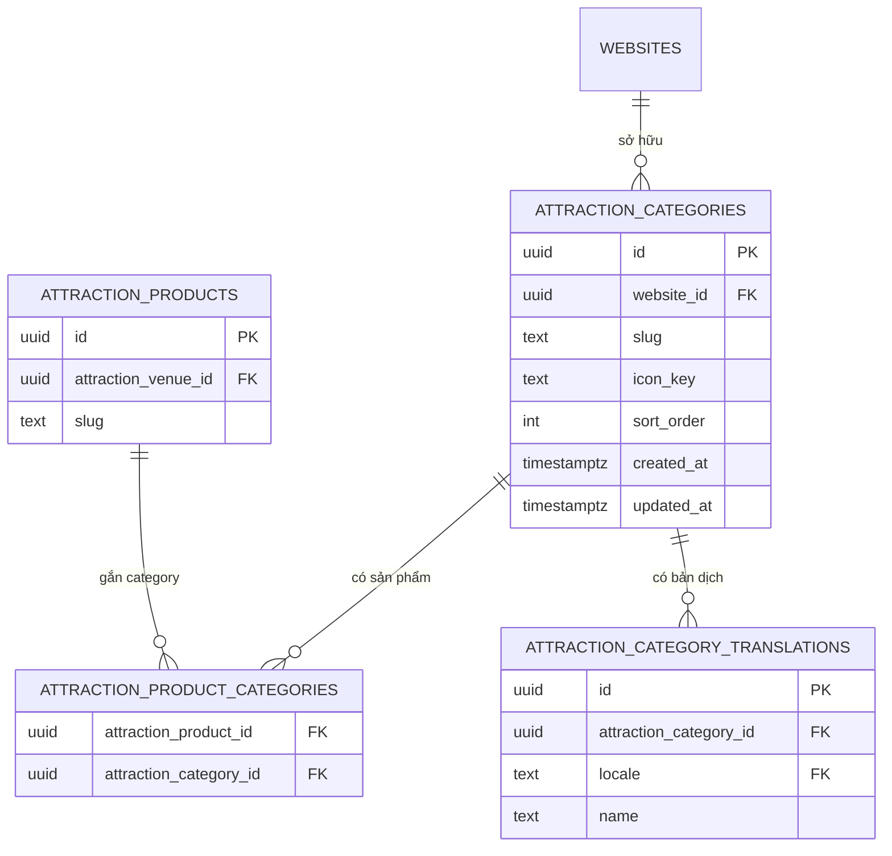
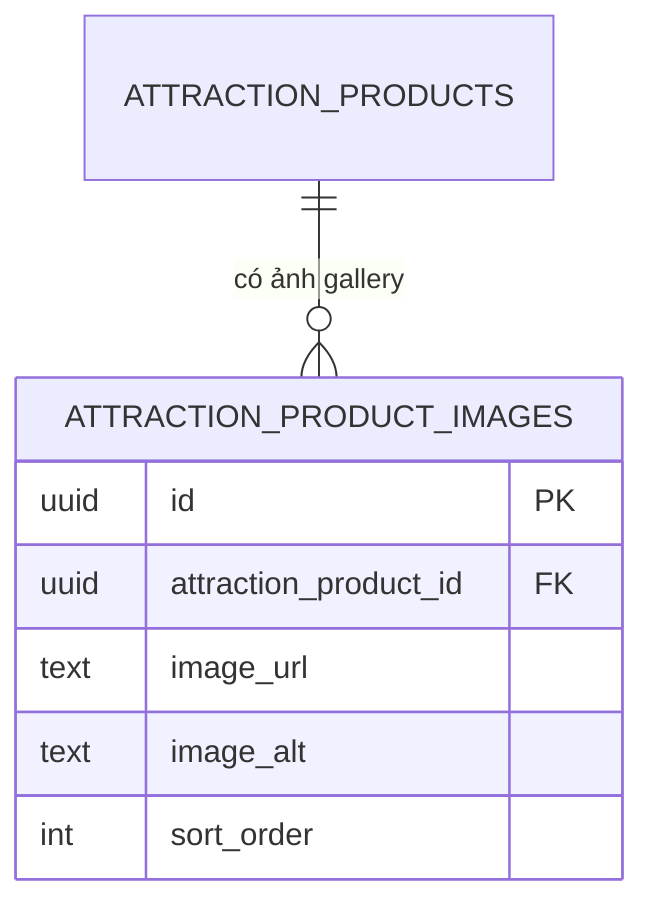
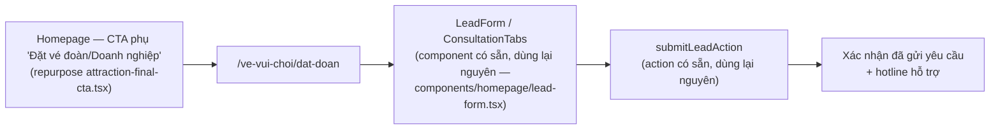

# MV Ticket — Review Package v1

**Trạng thái: ĐÃ DUYỆT VÀ ĐÃ APPLY (2026-07-28).** ⚠️ Nội dung "CHỜ DUYỆT" dưới đây là preview **tại thời điểm viết tài liệu này** — đã lỗi thời. Migration `0018`/`0019` + policy `0006` + seed `0008` đã được apply thật lên `mv-travel-os-dev` và Homepage đã được build/ghép lại xa hơn preview này mô tả. Xem trạng thái thật, đã kiểm chứng trực tiếp qua Supabase MCP + đọc code, tại **[`16-checkpoint-reconciliation-2026-07-28.md`](./16-checkpoint-reconciliation-2026-07-28.md)** trước khi dựa vào bất kỳ nội dung "chưa làm"/"MỚI" nào bên dưới.

**Đã hoàn thành trước checkpoint này (không thuộc phạm vi review — đã verify `pnpm typecheck`/`pnpm lint` pass):** token màu `--mv-ticket-orange`, restyle `AttractionProductCard`, mở rộng `AttractionVisualTile` (variant destination/brand), restructure `AttractionTicketHero` (60vh, search-centric). Không đụng database, không đụng route/trang khác.

---

## 1. Category ERD



**Quyết định:** bảng riêng, join thuần — đúng D2 (đã chốt, không dùng tag/jsonb). `icon_key` là text ngắn (vd. `"waves"`, `"cable-car"`) map sang tên icon Lucide phía frontend theo `08-iconography.md` §3 — không lưu SVG/markup trong DB. Không có cột `status`/lifecycle trên `attraction_categories` — taxonomy tĩnh do biên tập quản lý qua seed/CMS tối thiểu, không có vòng đời Draft/Published riêng (khác `attraction_content_overrides`).

**Không đụng:** `attraction_products`, `attraction_venues`, `0016`/`0017` — chỉ thêm bảng mới + FK trỏ vào `attraction_products(id)` đã có.

---

## 2. Gallery ERD

Hai lựa chọn đã nêu ở `13-asset-library-strategy.md` §3 — trình bày cả hai để duyệt, kèm đề xuất.

### Lựa chọn (a) — bảng riêng



### Lựa chọn (b) — cột `jsonb` (ĐỀ XUẤT chọn)

Không cần ERD riêng — chỉ thêm 1 cột vào bảng đã có:

```
attraction_products
  + gallery_images  jsonb  not null default '[]'
```

Mỗi phần tử: `{ "url": string, "alt": string, "sortOrder": number }`.

| Tiêu chí | (a) Bảng riêng | (b) Cột jsonb |
|---|---|---|
| Số lượng ảnh dự kiến/sản phẩm | 4–8 | 4–8 |
| Cần query độc lập ảnh (không qua sản phẩm)? | Không | Không |
| Cần sort/filter ở tầng SQL? | Có thể, nhưng không cần trong V1 | Sort làm ở application layer (đã có tiền lệ: `highlights jsonb` ở `attraction_venue_translations`) |
| Nhất quán với pattern đã dùng trong `0016`/`0017`? | Kém hơn — `0017` chọn cột phẳng thay vì bảng cho đúng 1 ảnh | Tốt hơn — cùng tinh thần "file tĩnh, không phải nội dung do người dùng upload" |
| Rủi ro migration | 1 bảng mới + FK + index | 1 cột `ALTER TABLE ADD COLUMN ... DEFAULT '[]'` |

**Đề xuất: (b).** Lý do chính: nhất quán trực tiếp với quyết định đã có trong `0017_attraction_ticket_images.sql` (comment gốc trong file đó giải thích rõ: ảnh là file tĩnh dưới `public/images/`, không phải `media_assets` storage-backed) — dùng `jsonb` tiếp tục đúng tinh thần đó, ít rủi ro hơn vì không thêm bảng/FK/index mới.

**Cần bạn xác nhận:** giữ đề xuất (b), hay muốn (a) để chuẩn hoá quan hệ hơn (đánh đổi: thêm 1 migration/bảng, nhiều hơn nhưng dễ mở rộng nếu sau này cần quản trị ảnh qua CMS UI riêng).

---

## 3. Homepage Wireframe

```
┌──────────────────────────────────────────────────────────┐
│ HERO — 60vh, overlay nhẹ, Search là trọng tâm bố cục       │  ĐÃ CODE, ĐÃ VERIFY
│         [Headline ngắn]                                    │  typecheck/lint pass
│         [ SEARCH BOX — lớn, giữa khung hình ]               │
│         [Trust badge nhỏ]                                  │
├──────────────────────────────────────────────────────────┤
│ CATEGORY CHIPS (cuộn ngang, icon + nhãn)                    │  MỚI — cần category
│ [Tất cả][Công viên nước][Cáp treo][Show diễn][Safari]...    │  thật (mục 1) trước khi
├──────────────────────────────────────────────────────────┤  hiển thị dữ liệu thật
│ DẢI — Được đề xuất hôm nay (is_featured/sort_order)          │  ĐÃ CÓ (AttractionFeatured
│ [ProductCard][ProductCard][ProductCard][ProductCard]…       │  Section) — chỉ cần restyle
├──────────────────────────────────────────────────────────┤
│ DẢI — Theo điểm đến nổi bật ("N vé đang bán" — D7)           │  ĐÃ CÓ (AttractionDestination
│ [DestinationTile][DestinationTile][DestinationTile]          │  Section) — productCount đã
├──────────────────────────────────────────────────────────┤  implement từ trước
│ DẢI — Theo category (Công viên nước & Cáp treo...)           │  MỚI — cần category thật
│ [ProductCard][ProductCard][ProductCard]…                    │
├──────────────────────────────────────────────────────────┤
│ THƯƠNG HIỆU/KHU VUI CHƠI NỔI BẬT — BẮT BUỘC (D6)             │  MỚI — cần venue
│ [BrandTile][BrandTile][BrandTile]                            │  is_featured=true có thật
├──────────────────────────────────────────────────────────┤
│ VÌ SAO MUA Ở MINH VIỆT (4 icon, đã gọn)                      │  ĐÃ CÓ, giữ gần nguyên
├──────────────────────────────────────────────────────────┤
│ FAQ (điều kiện — chỉ hiện khi có FAQ thật)                   │  ĐÃ CÓ
├──────────────────────────────────────────────────────────┤
│ Corporate CTA (repurpose từ "Liên hệ tư vấn" hiện tại) → D4  │  REPURPOSE, xem mục 7
└──────────────────────────────────────────────────────────┘
```

**Blocker rõ ràng:** 2 dải ("Category Chips", "Theo category") không có dữ liệu thật cho tới khi mục 1 (Category ERD) được duyệt + apply. Wireframe trình ở đây để duyệt bố cục, **chưa build**.

---

## 4. Listing Wireframe (`/ve-vui-choi/tat-ca`, `/ve-vui-choi/[destinationSlug]`)

```
┌──────────────────────────────────────────────────────────┐
│ Banner nhỏ (~25vh) — tên điểm đến/category + 1 dòng mô tả    │
├──────────────────────────────────────────────────────────┤
│ Filter ngang: [Điểm đến ▾][Category ▾][Khoảng giá ▾][Sắp xếp▾]│  Category ▾ cần mục 1
├──────────────────────────────────────────────────────────┤
│ Grid ProductCard — 2 cột mobile / 3–4 cột desktop            │
│ [Card][Card]                                                 │
│ [Card][Card]                                                 │
│ ... load more / pagination                                   │
└──────────────────────────────────────────────────────────┘
```

Trang này **đã tồn tại và chạy** (`app/ve-vui-choi/tat-ca/page.tsx`, `app/ve-vui-choi/[destinationSlug]/page.tsx`) — thay đổi dự kiến là restyle grid sang `ProductCard` mới + thêm filter Category (sau khi có dữ liệu), không phải viết lại route.

---

## 5. Product Detail Wireframe (`/ve-vui-choi/[destinationSlug]/[productSlug]`)

```
┌──────────────────────────────────────────────────────────┐
│ Breadcrumb                                                    │  ĐÃ CÓ
├──────────────────────────────────────────────────────────┤
│ GALLERY — vuốt ngang, đếm 1/N                                 │  MỚI — cần mục 2 (gallery)
├──────────────────────────────────────────────────────────┤
│ Tên vé · Venue · Điểm đến · Giá từ (đậm, orange)               │  ĐÃ CÓ (đổi màu giá)
├──────────────────────────────────────────────────────────┤
│ Benefits (bullet, từ highlights jsonb đã có)                   │  ĐÃ CÓ field, cần render
├──────────────────────────────────────────────────────────┤
│ BOOKING PANEL — radio loại vé · ngày · số lượng · tổng tiền     │  ĐÃ CÓ, ĐÃ CHẠY THẬT
│ (desktop: sticky phải — hiện chưa sticky; ẩn radio nếu 1 loại)  │  (gọi API availability/
│                                                                 │  bookings) — chỉ restyle
│                                                                 │  + 2 chỉnh sửa nhỏ (§6)
├──────────────────────────────────────────────────────────┤
│ Cách sử dụng vé (usage_guide) · Chính sách huỷ (cancellation)   │  ĐÃ CÓ field, cần render
├──────────────────────────────────────────────────────────┤
│ Vị trí (map, nếu có toạ độ)                                     │  Tuỳ chọn, thấp ưu tiên
├──────────────────────────────────────────────────────────┤
│ FAQ (điều kiện) · Sản phẩm liên quan (cross-sell)               │  ĐÃ CÓ bảng dữ liệu
└──────────────────────────────────────────────────────────┘
```

---

## 6. Checkout Wireframe — khuyến nghị: KHÔNG tạo route checkout riêng

Phát hiện quan trọng khi đọc code thật (`attraction-booking-panel.tsx`): luồng đặt vé **đã hoạt động dạng 1 trang duy nhất** — Booking Panel trong Product Detail đã gồm chọn vé + form liên hệ (họ tên/SĐT/email/ghi chú) + nút submit gọi thẳng `/api/v1/attraction-tickets/bookings`, có idempotency key, redirect sang `/ve-vui-choi/ket-qua/[orderCode]`.

```
┌──────────────────────────────────────────────────────────┐
│ (Trong Product Detail, không phải route riêng)                │
│ Loại vé (radio-card) · Ngày · Số lượng · Tổng tiền              │  ĐÃ CÓ
├──────────────────────────────────────────────────────────┤
│ Thông tin liên hệ: Họ tên · SĐT · Email · Ghi chú                │  ĐÃ CÓ
├──────────────────────────────────────────────────────────┤
│ ☐ Đồng ý điều khoản   [Đặt vé]                                  │  ĐÃ CÓ
└──────────────────────────────────────────────────────────┘
```

**Khuyến nghị:** giữ nguyên kiến trúc 1 trang này — **không thêm route `/ve-vui-choi/dat-ve/[bookingId]` riêng** như `05-ui-ux-specification.md` §5 từng để ngỏ. Lý do: (1) đúng nguyên tắc "Checkout là 1 trang, không chia nhiều bước" đã khoá ở `03-product-detail-and-checkout-concept.md` §2.2 — inline còn ít bước hơn cả tách route; (2) rủi ro thấp hơn nhiều — không viết lại luồng gọi API đang chạy đúng, chỉ restyle + sticky panel + ẩn radio khi 1 loại vé. Toàn bộ mục "Checkout" trong Design Bible áp dụng như các quy tắc trình bày cho chính Booking Panel này, không phải một trang mới.

**Cần bạn xác nhận:** đồng ý giữ kiến trúc 1 trang (khuyến nghị), hay vẫn muốn tách route checkout riêng như tài liệu Phase 0 từng để ngỏ.

---

## 7. Corporate Flow



**Không có trong V1** (đúng D4 — "không cần build hết"): báo giá tự động theo số lượng, luồng duyệt nội bộ, xuất hoá đơn VAT. Route + entry point là toàn bộ phạm vi V1.

**File cần đổi:** `attraction-final-cta.tsx` (đổi href `/contact` → `/ve-vui-choi/dat-doan`, đổi copy sang hướng nhóm/doanh nghiệp) + 1 file route mới `app/ve-vui-choi/dat-doan/page.tsx`. Không sửa `LeadForm`/`ConsultationTabs`/`submitLeadAction` — dùng nguyên.

---

## 8. Database Migration Preview (chưa apply)

### `0018_attraction_ticket_categories.sql`

```sql
-- 0018_attraction_ticket_categories.sql
-- Purpose: category taxonomy for the Attraction Ticket module (D2, docs/
-- design/DESIGN-BIBLE-v1.0.md) — separate table, not tag/jsonb. Additive
-- only; does not touch 0016/0017.

create table attraction_categories (
  id uuid primary key default gen_random_uuid(),
  website_id uuid not null references websites(id),
  slug text not null,
  icon_key text not null,
  sort_order integer not null default 0,
  created_at timestamptz not null default now(),
  updated_at timestamptz not null default now(),
  unique (website_id, lower(slug))
);
create trigger set_updated_at before update on attraction_categories
  for each row execute function set_updated_at();
create index attraction_categories_website_id_idx on attraction_categories(website_id);

create table attraction_category_translations (
  id uuid primary key default gen_random_uuid(),
  attraction_category_id uuid not null references attraction_categories(id) on delete cascade,
  locale text not null references languages(code),
  name text not null,
  unique (attraction_category_id, locale)
);

create table attraction_product_categories (
  attraction_product_id uuid not null references attraction_products(id) on delete cascade,
  attraction_category_id uuid not null references attraction_categories(id) on delete cascade,
  primary key (attraction_product_id, attraction_category_id)
);
create index attraction_product_categories_category_id_idx on attraction_product_categories(attraction_category_id);

comment on column attraction_categories.icon_key is
  'Short key mapped to a Lucide icon name client-side (docs/design/mv-ticket/08-iconography.md §3) — never raw SVG/markup stored here.';
```

### RLS — `database/policies/0006_attraction_ticket_categories_policies.sql`

```sql
-- Public read: category thuộc website hiện tại, không có lifecycle riêng.
alter table attraction_categories enable row level security;
alter table attraction_category_translations enable row level security;
alter table attraction_product_categories enable row level security;

create policy attraction_categories_public_read on attraction_categories
  for select using (true);  -- taxonomy tĩnh, không có status field để lọc

create policy attraction_category_translations_public_read on attraction_category_translations
  for select using (true);

create policy attraction_product_categories_public_read on attraction_product_categories
  for select using (true);

-- Ghi: chỉ staff có permission attraction_ticket.category.write (permission
-- key mới, thêm vào seed permissions — không đổi cấu trúc bảng permissions).
```

### `0019_attraction_ticket_gallery.sql` (theo đề xuất (b) ở mục 2)

```sql
-- 0019_attraction_ticket_gallery.sql
-- Purpose: multi-image gallery for Product Detail. Zero existing rows
-- reference this column today, same NOT NULL-with-default-then-drop-
-- default pattern as 0017 is unnecessary here since '[]' is a valid
-- permanent default (empty gallery), not a placeholder needing backfill.

alter table attraction_products add column gallery_images jsonb not null default '[]';

comment on column attraction_products.gallery_images is
  'Array of {url, alt, sortOrder} — static files under public/images/, same pattern as image_url/image_alt in 0017. Not media_assets-backed.';
```

---

## 9. Migration Safety Report

| Hạng mục | Đánh giá | Ghi chú |
|---|---|---|
| Loại thay đổi | 100% additive — 3 bảng mới (`0018`) + 1 cột mới (`0019`) | Không `ALTER`/`DROP` bất kỳ cột/bảng nào đã tồn tại |
| Ảnh hưởng `0016`/`0017` | Không | Không sửa 1 dòng nào trong 2 file đó |
| Ảnh hưởng module khác (Flight/Combo/Tour/MICE) | Không | Bảng mới chỉ FK vào `attraction_products`/`websites`/`languages` — không module nào khác đọc bảng này |
| Rủi ro khoá bảng (table lock) khi chạy | Thấp | `attraction_products` hiện 0 dòng thật (chưa go-live) theo `00-current-state-audit.md` — `ALTER TABLE ADD COLUMN ... DEFAULT '[]'` trên bảng rỗng là tức thời, không quét toàn bảng |
| Cần backfill dữ liệu? | Không | `gallery_images` mặc định `'[]'` hợp lệ vĩnh viễn (không phải giá trị tạm chờ điền), category là bảng mới rỗng, cần seed thủ công sau khi tạo (không tự động) |
| RLS | Bật ngay từ đầu cho cả 3 bảng category (đúng nguyên tắc "RLS bật cho mọi bảng mới, không ngoại lệ" — `03-database-design.md`) | Chính sách đọc công khai đơn giản (không có `status` field để lọc vì đây là taxonomy tĩnh, không phải content có vòng đời) |
| Permission mới | 1 key `attraction_ticket.category.write` cần thêm vào seed `permissions` | Không đổi cấu trúc bảng `permissions`, chỉ thêm dòng seed — đúng pattern đã dùng cho các permission `attraction_ticket.*` khác |
| Rủi ro với ứng dụng đang chạy (frontend hiện tại) | Không | Không component/route nào hiện tại query các bảng/cột mới này — thêm bảng/cột không tự động đổi hành vi bất kỳ trang nào đang chạy cho tới khi có code mới đọc chúng |
| Kiểm tra trước khi apply | Cần | Chạy trên `mv-travel-os-dev` (không phải production), xác nhận `select count(*) from attraction_products` = 0 trước khi chạy `0019` để khẳng định giả định "bảng rỗng" ở trên là đúng tại thời điểm apply |

**Kết luận:** rủi ro kỹ thuật thấp — đây là dạng migration an toàn nhất có thể (thêm mới thuần tuý, không có bảng nào đang có dữ liệu thật bị đụng tới). Rủi ro thực sự nằm ở **quyết định thiết kế** (bảng riêng vs jsonb ở mục 2, cấu trúc IA ở mục 3–6), không nằm ở an toàn kỹ thuật của bản thân câu lệnh SQL.

---

## 10. Rollback Plan

### Nếu cần rollback `0018` (categories)

```sql
drop table if exists attraction_product_categories;
drop table if exists attraction_category_translations;
drop table if exists attraction_categories;
```

Thứ tự xoá theo đúng chiều ngược FK (join table trước, bảng cha sau). An toàn tuyệt đối vì chưa có component/route nào đọc các bảng này — rollback không làm hỏng bất kỳ trang đang chạy nào.

### Nếu cần rollback `0019` (gallery)

```sql
alter table attraction_products drop column if exists gallery_images;
```

An toàn tương tự — không component nào đọc `gallery_images` cho tới khi `attraction-gallery.tsx` (component mới, chưa viết) được code.

### Điều kiện rollback theo từng giai đoạn

| Đã làm tới đâu | Cách rollback |
|---|---|
| Chỉ mới apply migration, chưa viết UI đọc dữ liệu | 2 câu lệnh DROP ở trên, xong ngay, 0 rủi ro |
| Đã seed category/gallery mẫu nhưng chưa merge UI | Xoá dữ liệu seed (`delete from attraction_categories where ...`) hoặc DROP thẳng bảng — dữ liệu seed không phải dữ liệu khách hàng thật |
| Đã merge UI đọc category/gallery | Revert PR code trước, sau đó mới DROP bảng (không đảo ngược thứ tự — tránh UI gọi vào bảng không còn tồn tại) |

**Rollback không cần feature flag riêng** (khác `ONEINVENTORY_ENABLED` — trường hợp đó cần vì gọi ra hệ thống ngoài) — category/gallery là dữ liệu nội bộ thuần tuý, ẩn/hiện tự nhiên qua việc bảng có dữ liệu hay không (đúng nguyên tắc "ẩn khi không có dữ liệu" đã khoá xuyên suốt Design Bible).

---

## Việc cần bạn xác nhận trước khi apply migration + code tiếp

**ĐÃ DUYỆT (2026-07-28) — xem `16-checkpoint-reconciliation-2026-07-28.md` §4:**

1. **Gallery:** ✅ (b) cột `jsonb` — đã apply đúng đề xuất, không tạo bảng riêng.
2. **Checkout:** ✅ giữ kiến trúc 1 trang inline, không tách route riêng.
3. **Layout Homepage/Listing/Product Detail:** ✅ xác nhận đúng ý (Marketplace Hero Concept 5 + Experience Commerce Card Concept 4).
4. **SQL preview mục 8:** ✅ đã apply đúng như preview, không sửa đổi gì thêm.

Chữ ký phê duyệt bên dưới không còn áp dụng — quyết định đã được ghi nhận qua hội thoại trực tiếp với chủ dự án và migration đã chạy thật, không rollback/chạy lại.

```
Người duyệt:        ____________________
Ngày duyệt:         ____________________
Duyệt apply migration 0018/0019:  [x] Có
Duyệt tiếp tục build Homepage/Listing/Product Detail/Checkout/Corporate:  [x] Có
```
